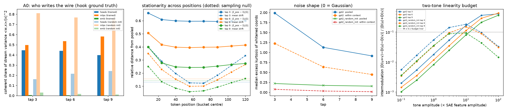
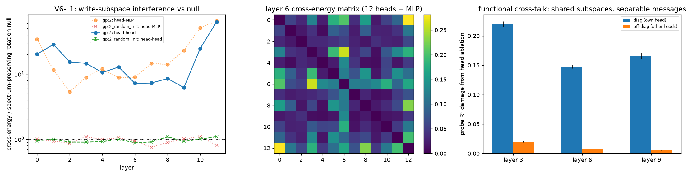
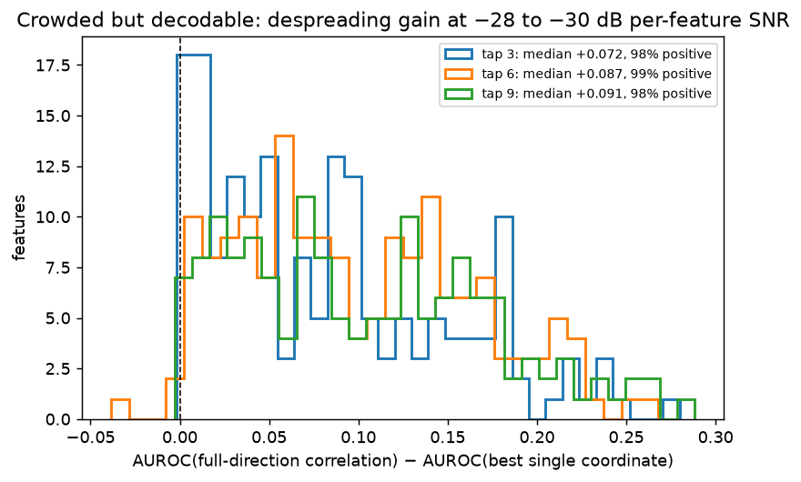
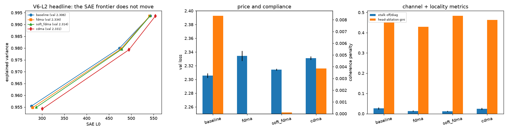
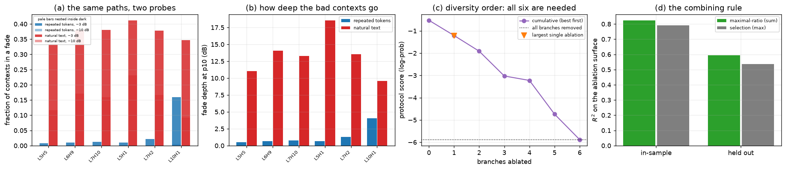
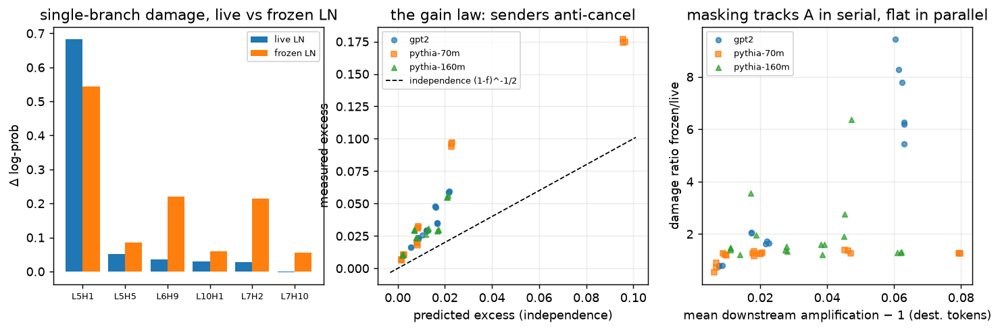
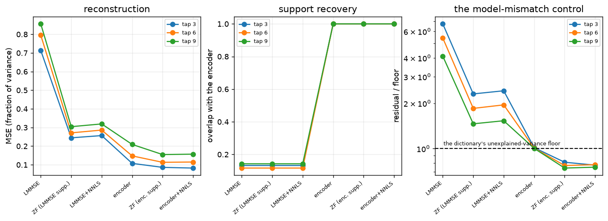
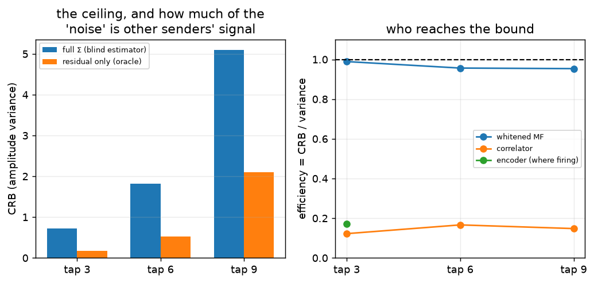

# Serial Residual Streams Are a Multiple-Access Channel

> **A human disclaimer.** The AI has produced stunning achievements in applied
> mathematics. I found myself between jobs for a weekend, so I decided to join the AI
> research train before I became busy again. I directed Claude Fable to work on an old idea of mine
> from the pre-transformer days, whether DNNs are some form of communication channel,
> in the EE sense. The answer appears to be a conditional yes. Too bad too many years have passed
> and I can no longer fully judge its work, but here it is. — ivanamies

**TL;DR.** We took "the residual stream is a multiple-access channel" literally. Heads run
deliberate CDMA (serial archs only). LayerNorm is blind AGC — hold it still and ablation damage
grows 2–8×; "self-repair" is half gain compensation, half real redundancy. Steering has a duty
cycle.

## Notation, units, and the cast

Read this once; everything below leans on it.

- **The medium** is the transformer's *residual stream* — called the stream, the wire, or the
  channel below; all three name the same object. **Tap N** = the stream read just after block N.
  GPT-2-small has 12 blocks; taps 3/6/9 sit at quarter, half, and three-quarter depth.
- **The writers** (also: senders, stations) are the 144 attention heads and 12 MLPs that add into
  the stream. A **reader** is anything consuming the stream through a LayerNorm. A **branch** or
  **path** is one head's route from its write to a downstream reader. A **protocol** is a
  multi-head behavior; the one used throughout is *induction* — continuing a repeated sequence —
  with its heads located by construction, not from a curated list: on random-token sequences
  repeated twice, an induction head is one that attends from a second-copy token to the successor
  of its first occurrence.
- **Seeds.** On frozen models, a seed is an independent redraw of the probe (feature draws, token
  slices, control directions) — nothing is retrained. In §5, which trains small models from
  scratch, seeds are training seeds. Three seeds throughout unless a deviation is stated.
- **The roster** (8 models, 5 families): serial-residual — GPT-2-small, OPT-125m, Qwen2.5-0.5B;
  parallel-residual — Pythia-70m/160m/410m/1.4b, CodeGen-350m. *Serial*: the block's MLP reads
  what its own attention just wrote. *Parallel*: attention and MLP both read the block's input.
- **Units.** dB = 10·log₁₀(power ratio). Injection amplitudes are multiples of a feature's median
  non-zero activation. Loss costs are relative increases in task cross-entropy. **Diversity
  order** = how many redundant branches must be removed before a function fails. A protocol's
  **span** = its log-prob drop from intact to all branches removed.
- **Acronyms.** SAE: sparse autoencoder (the reading dictionary). AGC: automatic gain control.
  IM: intermodulation — response at mixed frequencies that only nonlinearity can create. AM/FM:
  amplitude/frequency modulation. CDMA/FDMA: code-/frequency-division multiple access (sharing a
  channel by overlapping codes vs disjoint bands). SIC: successive interference cancellation.
  LMMSE: linear minimum-mean-square-error estimation. ZF: zero-forcing. OMP: orthogonal matching
  pursuit. CRB: Cramér–Rao bound — the best variance any unbiased estimator can achieve. NLL:
  negative log-likelihood. AUROC: area under the ROC curve. L₀: number of non-zero entries.
  KLT: Karhunen–Loève transform — the eigenbasis of the covariance, the optimal linear reader.

## 0. Background and prior work

The residual stream as a shared communication channel that layers write into and read from is the
framing of [1], which also names the "bandwidth" problem this paper measures. Superposition — more
features than dimensions, deliberately overlapped — is the theory of [2]; the sparse-autoencoder
dictionaries used as reading tools throughout are from [6], and the specific pinned GPT-2-small
release is [7]. Induction heads, the protocol ablated in §7, are from [3]. Self-repair after
ablation ("the Hydra effect") was reported by [4]; [5] independently reported LayerNorm as a
contributor to self-repair, which we repurpose as an external near-replication of §7(b) — our
addition is the frozen-denominator decomposition, the quantitative gain law, and the controls.
LayerNorm itself is [12]. The telecom machinery is textbook: multiuser detection (matched filter,
SIC, decorrelating/LMMSE receivers) from [8]; fading, diversity, and combining from [9]; the
Cramér–Rao bound from [10]; the Welch bound on cross-correlations of overloaded codebooks from
[11]; greedy sparse recovery from [16]. Steering vectors, whose reliability §6 conditions, are from
[14]. Outlier/massive-activation dimensions and attention sinks, relevant to the gain-control
findings, are [13]. Models and corpora: GPT-2 [15a], Pythia [15b], TinyStories [15c].

## 1. What this paper establishes

| claim | where |
|---|---|
| The residual stream supports a linear signal model inside a measured amplitude budget | §2 |
| Head write-subspaces overlap deliberately — code-division — in serial-residual architectures | §3, §4 |
| Designed channel-sharing is nearly free and functionally inert | §5 |
| Feature paths fade contextually; "this steering vector works" has a duty cycle | §6 |
| The channel absorbs damage: diversity order ~6 by direct measurement, and roughly half the absorption is the receiver's own gain control | §7 |
| The learned encoder's advantage over derived receivers is support selection, not amplitude estimation — which the matched filter already performs at 93–100% of the Cramér–Rao bound | §8 |

## 2. The channel datasheet

**Claim.** The stream's writers, noise, and linear operating range are measurable, and a linear
multiple-access model [1, 2] is licensed at ≤3× typical feature amplitude (taps 3/6), ≤10× (tap 9).

**Method.**
- Exact writer decomposition via forward hooks on every attention output projection and MLP:
  `ecc_repr/wire.py::WriterTap` (L39), `wire.py::decompose` (L76).
- Noise statistics (whitened tails, positional/domain covariance drift): `wire.py::datasheet` (L136).
- Two-tone linearity test, amplitudes in per-feature median-activation units:
  `wire.py::two_tone` (L204); driver `wire.py::run` (L261).

**Controls.** *Positive:* at 100× amplitude the two-tone test must show saturation — IM = 0.41
observed. *Negative:* a random-init model of the same architecture — its tail mass is 1–4% (vs 34% trained),
and its two-tone response saturates globally (gain 0.71 of linear) rather than holding a linear region. *Loading:* embedding + Σwrites reproduces every tap to
relative error 2×10⁻⁷; identical tokens across conditions.

**Result.** MLPs carry 50–58% of coherent stream variance vs heads' 40–44%. 34% of tokens lie
beyond the 99th-percentile χ² reference for their Mahalanobis radius (i.e., 34× the Gaussian rate). IM stays below 0.1 up to 3× (taps 3/6) and 10× (tap 9); every
later injection respects that budget. Raw data: `artifacts/results/wire_datasheet.json`; exported
covariances `artifacts/results/wire_cov_tap{3,6,9}.pt`.

**Scale & generality.** GPT-2-small [15a], 3 seeds, TinyStories [15c] with WikiText cross-checks.
Heavy tails and rotation-before-compression replicate across the 5-model/3-family census (§9);
"MLPs lead at every depth" is GPT-2-specific and stated as such.

**Images.** 
`p1_f0_datasheet` — reused across papers via the figure map in `ecc_repr/figs_dist.py` (L44); regenerate with
`paper1/build.sh` or `scripts/build.sh figs`. Figure CSVs land in `artifacts/figdata/`.

**Plainly.** Before arguing about how 150 writers share one wire, we measured the wire: who writes
it, how noisy it is, and how hard you can push before it stops responding proportionally — like
checking an amplifier's spec sheet before plugging in a guitar. Everything later stays inside spec.

## 3. The senders coordinate

**Claim.** After whitening by the stream's own covariance, head write-subspaces overlap 1.3–33×
above a random-init null (11 of 12 layers above 2×) — yet ablating a head damages the readability
of other heads' messages by at most 9% of its self-damage, and a single feature at −28 to −30 dB
per-feature SNR is recovered at AUROC 0.993–0.995. Crowded but decodable: code-division, the
superposition of [2] measured as a communication scheme [1, 8].

**Method.**
- Write-subspace geometry and whitened overlap: `ecc_repr/census.py` (saves at L328 geometry,
  L512 whitened).
- Functional cross-damage: `census.py` (save at L384).
- Despreading/detection against dictionary atoms [6, 7]: `census.py` (save at L435); matched-filter
  variants and planted task in `ecc_repr/filters.py::run` (L68).

**Controls.** *Positive:* planted injections give ground truth by construction — detection must
succeed at high amplitude, and does. For the overlap statistic itself: partial gap — no model with
designed-in overlap was scored with it (acknowledged; the §5 models would be the natural retrofit).
*Negative:* random-init overlap null; shuffled labels for despreading (AUROC 0.5). *Loading:* each
model whitened by its own covariance — effective rank is 64–96 of 768, and unwhitened anisotropy
alone manufactures apparent coordination; despreading amplitudes inside the §2 budget.

**Result.** Whitened overlap 1.3–33× above null (11/12 layers >2×); cross-damage ≤9%; presence
recovery AUROC 0.993–0.995 at −28 to −30 dB. The geometric/functional disagreement is the finding.
Raw data: `artifacts/results/macl_l1_geometry.json`, `macl_l1_whitened.json`,
`macl_l1_functional.json`, `macl_l15_despreading.json`.

**Scale & generality.** Overlap: 8 models, 5 families (§4). Despreading: GPT-2, 3 seeds = 3
disjoint 100-feature draws, taps 3/6/9.

**Images.** 

`p1_f1_interference` — reused via the figure map in `figs_dist.py` (L44); `p1_f6_despreading` —
`ecc_repr/figs_papers.py::p1_f6_despreading` (L208). Regenerate: `paper1/build.sh`.

**Plainly.** The stations chose overlapping frequencies on purpose — far more overlap than chance —
and yet each broadcast stays individually readable, the way CDMA phones share one band by using
different spreading codes rather than different frequencies. Each message is a whisper a thousand
times quieter than the total signal, but if you know its code, you recover it almost perfectly.

## 4. The claim is architectural

**Claim.** Deliberate overlap holds in serial-residual transformers (whitened overlap 3.14–4.12)
and not in parallel-residual ones (0.64–1.59), with no overlap between groups.

**Method.**
- The §3 statistic across a roster, architecture-generic taps: `ecc_repr/generalize.py::m_overlap`
  (L254); roster driver `generalize.py::run` (L625).
- Per-model random-init construction: `generalize.py::random_init_like` (L125).

**Controls.** *Positive:* the GPT-2 anchor re-measured inside the roster pipeline reproduces the
single-model number. *Negative:* per-model random-init; the reported statistic is the
trained-over-random double ratio, so each architecture carries its own null. *Loading:* corpus size
held identical across models; only direction and ordering compared, never constants.

**Result.** Serial 3.14–4.12 vs parallel 0.64–1.59, no overlap between groups; GPT-2 vs
pythia-160m [15b] are parameter-matched and land on opposite sides, excluding scale. Raw data:
`artifacts/results/generalize_e3.json`.

**Scale & generality.** 8 models, 5 families. This section is §3's generality statement: the
headline is a property of residual wiring, not of transformers.

**Images.** None — the table above is the result; a figure would add nothing to eight rows.

**Plainly.** Two radios can have identical part counts but different wiring diagrams. Only one
wiring style produces the deliberate-overlap behavior — so this is a fact about the layout, not
about "AI" in general. We know it isn't size because two same-size networks with different layouts
land on opposite sides.

## 5. Designed sharing is cheap and buys nothing

**Claim.** Imposing textbook multiple-access schemes [8] from scratch — hard frequency-division, a
coherence penalty, random spreading frames — costs ≤1.2% loss, halves functional cross-talk, and
moves the sparse-autoencoder frontier by exactly zero.

**Method.**
- Train tiny models from scratch per scheme; evaluate: `ecc_repr/macl.py::l2_eval` (L151),
  aggregate `macl.py::l2_aggregate` (L166).
- Cross-talk probes: `macl.py::tiny_crosstalk` (L53).
- Reader-independence guard (KLT scoring): `macl.py::tiny_crosstalk_klt` (L99), `macl.py::l2_klt`
  (L133).

**Controls.** *Positive:* the intervention demonstrably lands — cross-talk is halved, so the null
frontier result cannot be blamed on an inert manipulation. *Negative:* from-scratch baselines, same
recipe. *Loading:* matched training budgets across arms; KLT re-scoring excludes "your dictionary
just can't read the new code."

**Result.** ≤1.2% loss cost, cross-talk halved, frontier moved zero: designed coordination is
nearly free and functionally inert at this scale. Raw data: `artifacts/results/macl_l2_agg.json`
and per-run `macl_l2_{baseline,fdma,soft_fdma,cdma}_s{0,1,2}.json`.

**Scale & generality.** From-scratch small models, 3 seeds per arm. Not measured beyond the scale
where imposing schemes is affordable.

**Images.** 
`p1_f2_l2` — reused via the figure map in `figs_dist.py` (L45). Regenerate: `paper1/build.sh`.

**Plainly.** We built networks where the stations were forced to share politely — separate lanes,
or assigned spreading codes. It barely cost anything, it measurably reduced crosstalk, and it made
zero difference to how well the network's contents could be read out. Whatever the messy overlap is
doing, tidying it up neither helps nor hurts.

## 6. Paths fade

**Claim.** On natural text, a feature path written early and read late sits ≥3 dB below its median
gain in 33–41% of contexts and ≥10 dB down in 12–23%, with fades persisting ≈1 token — while a synthetic
probe of the same heads shows 0.8–1.2%. Steering [14] therefore carries a duty cycle; fading and
its vocabulary from [9].

**Method.**
- Synthetic-probe fading census: `ecc_repr/diversity.py::fading_census` (L245).
- Natural-text census with mandatory positional conditioning:
  `diversity.py::fading_census_natural` (L360).
- Per-direction reliability datasheet (tap 3 → tap 9 injections):
  `diversity.py::direction_reliability` (L405).

**Controls.** *Positive:* gap — no known-attenuation calibration was injected; a Rayleigh reference
(matches at 3 dB, under-predicts 2–3× at 10 dB) is a sanity anchor only. *Negative:* the synthetic
probe, where contextual fading is absent; and the positional-conditioning check — statistics
reported before and after dividing out per-position means; anything not surviving is reported as
the positional address bus, not fading. *Loading:* matched position via the conditioning; identical
contexts across directions.

**Result.** 33–41% of contexts ≥3 dB down, 12–23% ≥10 dB, coherence ≈1 token, position explains 0%
after conditioning; synthetic probe 0.8–1.2%. Raw data:
`artifacts/results/macl_l4pre_fading.json`, `macl_l4pre_fading_natural.json`,
`macl_l4pre_directions.json`.

**Scale & generality.** GPT-2, 3 seeds, TinyStories contexts. The synthetic/natural gap is the
methods warning: synthetic probes understate real-channel variability by an order of magnitude.

**Images.** 
Fading panels inside `ecc_repr/figs_papers.py::p1_f4_diversity` (L226). Regenerate:
`paper1/build.sh`, or directly `.venv/bin/python -m ecc_repr.figs_papers p1_f4`.

**Plainly.** A message sent from an early layer to a late one sometimes arrives loud and sometimes
arrives buried, depending on what else the text is doing — like a car radio cutting out under a
bridge. In a tenth to a quarter of real sentences the path is badly faded. Tests on clean
artificial inputs almost never see this, which is exactly why they mislead.

## 7. The channel absorbs damage — and half the absorption is the receiver's gain control

**Claim.** (a) Direct measurement: removing the largest single branch of an induction protocol [3]
costs 13% of its span (the span — intact minus all-six-removed — is 5.36 nats); all six branches
are needed to reach the floor; pair superadditivity (a pair's damage over the sum of its singles')
is 1.19;
single-ablation statistics undercount the order ~4× (the Hydra effect of [4], as a number).
(b) Decomposition: with every LayerNorm [12] denominator frozen to its unablated per-token value,
non-dominant branch damage grows 2–8× (per-seed medians 2.0/2.1/6.1) — roughly half the apparent
absorption is receiver-side gain control, not redundancy; the knockout survives the freeze (order
5–6). Externally corroborated in kind by [5]. (c) The masking is quantifiable: measured
amplification exceeds the independence prediction (1−f)^(−1/2) by a consistent 2.6–3.4× (senders
anti-cancel, cf. §3), concentrates at protocol destination tokens, persists at every downstream
LayerNorm, and in serial models ranks which single-ablation numbers understate damage (Spearman
0.79), with ~1.3× understatement as the observed floor.

**Method.**
- Diversity census (singles → cumulative knockout, mean-ablation, mechanical head finding):
  `ecc_repr/diversity.py::diversity_census` (L545), `repeat_batch` (L111), `HeadAblator` (L148).
- Frozen-denominator rerun: `ecc_repr/agc.py::agc_census`; freezing hook `agc.py::LNFreeze`.
- Gain law (per-LN σ ratios paired with writer-decomposition f):
  `ecc_repr/agc_law.py::agc_law`, meter `LNGainMeter`.
- Instrument unit tests: `tests/test_agc_crb.py`.

**Controls.** *Positive:* the all-six ablation verifies the assay detects full destruction (span 5.36 nats); the synthetic unit test verifies the gain meter — deleting a 50%-variance independent
component must amplify survivors by √2, and does. *Negative:* LayerNorms upstream of the write show
amplification exactly 1 (locates the first reader empirically); the random-init rerun shows the
damage-surface fit is unrelated to the gain mechanism (Appendix A). *Loading:* mean-ablation, not
zero-ablation; a frozen clean forward reproduces the clean score to 3×10⁻⁷; gain and damage
measured on identical batches, per-token paired.

**Result.** Largest branch 13% of span; six branches to the floor; masking ratios 2.0/2.1/6.1;
law under-prediction 2.6–3.4×; serial masking tracks amplification at Spearman 0.79. Practical
residue: a two-forward-pass diagnostic — A is measurable from σ ratios alone and, in
serial-residual models, predicts which ablation studies undercount and roughly by how much. Raw
data: `artifacts/results/macl_l4_diversity.json`, `macl_l4_agc.json`, `agc_law.json`.

**Scale & generality.** Direct measurements and decomposition: GPT-2, 3 seeds. The law: GPT-2 +
pythia-70m + pythia-160m, 3 seeds each, 54 branch-rows. The gain law generalizes across wiring; the
damage link is graded in serial models and flat (~1.3×) in parallel ones.

**Images.** 
Knockout/diversity panels: `figs_papers.py::p1_f4_diversity` (L226); the AGC decomposition and gain
law: `figs_papers.py::p1_f7_agc`. Regenerate: `paper1/build.sh`.

**Plainly.** Cut one of the network's six backup cables and almost nothing seems to break. Half of
that "toughness" is real redundancy — you truly need to cut all six. The other half is an illusion
created by an automatic gain control: cut a cable, the internal signal gets quieter, a normalizer
turns everything back up, and the injury is masked. Hold the knob still and the same cut costs two
to eight times more. Anyone who measures a network by deleting parts is being fooled by this knob,
and we provide a two-measurement test for how badly.

## 8. Receivers: the hard part is choosing, not measuring

**Claim.** Choosing *which* features are present (support selection) is what the learned encoder
does better than every derived receiver [8, 16]; measuring *how much* is essentially solved — the
whitened matched filter empirically reaches 93–100% of the Cramér–Rao bound [10] (bias ≤1.2%). The
code's conditioning is benign: the encoder picks near-orthogonal working sets (support Gram condition number 46–118 — small enough that zero-forcing on those supports is
numerically stable, which is the operational meaning of "benign"; a 32:1-overloaded dictionary
permits vastly worse) from that overloaded dictionary — overload that guarantees interference by the
Welch bound [11] — so §3's geometric overlap is never paid at decode time.

**Method.**
- Greedy tier (matched filter, whitened SIC, OMP): `ecc_repr/filters.py` (SIC/greedy paths).
- Joint linear receivers (LMMSE, ZF) at matched sparsity:
  `ecc_repr/receivers.py::joint_receivers` (L89), NNLS at L51.
- Pursuit variants: `ecc_repr/receivers_pursuit.py::ladder` (L89).
- Cramér–Rao bounds and empirical efficiency with planted amplitudes:
  `ecc_repr/crb.py::run` / `crb_tap`.

**Controls.** *Positive:* the same solver handed the encoder's own support beats the encoder
(reconstruction error 0.082 vs 0.108, as a fraction of stream variance, tap 3); on synthetic Gaussian data the whitened MF achieves the
bound within 5% (`tests/test_agc_crb.py`). *Negative:* shuffled-pairing nulls; the unwhitened
correlator, necessarily inefficient in colored noise, measures 0.12–0.17. *Loading:* every receiver
thresholded to the encoder's mean L₀; identical tokens and planted amplitudes, inside the §2 budget.

**Result.** The same-solver comparison isolates support selection as the entire remaining gap. CRB medians (best achievable variance of an amplitude estimate, in squared activation units)
0.72/1.82/5.10 at taps 3/6/9; whitened MF at 93–100% of the bound; an oracle facing only
the dictionary-unexplained residual gets a bound tighter by 0.24–0.43 — most of what a blind
estimator calls noise is other senders' signal. The encoder as an amplitude estimator fires on
<1.3% of out-of-context planted tokens even at 3×: support selection is contextual. Raw data:
`artifacts/results/macl_l5_receivers.json`, `macl_l5_receivers_parallel.json`,
`filters_sic.json`, `crb_receiver.json`.

**Scale & generality.** GPT-2 taps 3/6/9, 3 seeds (60–100 features per draw). The support-selection
obstacle survives a parallel-residual model (pythia-160m) with a five-times-more-complete
dictionary — a well-posed open problem, not a quirk.

**Images.** 

`figs_papers.py::p1_f5_receivers` (L291) and `figs_papers.py::p1_f8_crb`; regenerate
`paper1/build.sh` or `.venv/bin/python -m ecc_repr.figs_papers p1_f5 p1_f8`.

**Plainly.** In a room where dozens of people might be talking, working out how loudly any *given*
person speaks is easy — our simple filter does it at 93–100% of the physical limit, so no
cleverness is left there. The hard problem is knowing *who is talking at all*. The network's own
learned reader is excellent at that, and nothing derived from first principles comes close —
because who's talking depends on context the room's audio alone doesn't contain.

## 9. What replicates

**Policy.** Direction and ordering must replicate; constants never.

**Method.** Roster census, dictionary-free measurements only: `ecc_repr/generalize.py::run` (L625),
groups datasheet/overlap/steering/healing.

**Result.** Replicates (5 models, 3 families, corpus size held identical): heavy tails; and rotation-before-compression — an injected direction's *angle* degrades before its
*magnitude* does, the companion paper's mechanism (`paper2/SURVEY.md`). Model-specific, restated as such: "MLPs lead at every depth," "the
writer gap grows with depth." Raw data: `artifacts/results/generalize_e3.json`.

**Images.** None — the replication lists above are the result.

**Plainly.** Rules that survive across different networks get stated as rules; numbers that change
from network to network get labeled as facts about one network. The paper polices itself by that
line.

---

## Appendix A — retracted and negative claims, and what killed them

Kept out of the main text by editorial policy; kept in the paper because the kills are load-bearing.

- **"SGD found the optimal (maximal-ratio) combining rule."** Registered, then retracted: the
  identical discrimination on a random-init model — same path-selection procedure, same probe, same
  fit — favors maximal-ratio by a *wider* margin (R² 0.978 vs 0.176; trained 0.823 vs 0.791). A
  discriminator that fires without the phenomenon discriminates nothing; no replacement claim was
  erected on the same measurement. (GPT-2 + random-init, 3 seeds; `macl_l4_diversity.json`,
  `generalize_e3.json`. The frozen-LN rerun shows the sum-shaped fit also persists with the gain
  knob held still — 0.996 vs 0.046 on random-init — so the retraction is not explained away by
  gain control either; `macl_l4_agc.json`.)
- **"Entrenchment."** Coherence-direction curvature indistinguishable from an equal-norm random
  direction (1.07 ± 0.21), against an LM-gradient direction 85,000× stiffer. Ordinary stiffness;
  withdrawn. (GPT-2, 3 seeds; `macl_l3_curvature.json`.)
- **The serial-wiring mechanism ("same-layer MLP consumers").** Failed its own concentration test:
  excess overlap concentrates in the same-layer MLP read subspace by 1.9–5.9× in *both* wirings,
  highest in a parallel model. Correlation, not mechanism. (`generalize_e3.json`.)
- **"The learned code resists joint linear detection."** Forbidden by the registered two-sided
  control: LMMSE's residual sits *above* the dictionary's 11–21% unexplained-variance floor — the
  solve fights unmodelled signal; dictionary coverage is indicted, not the code.
  (`macl_l5_receivers.json`.)
- **"LayerNorm destroys absolute amplitude"** (a working assumption of this program, corrected by
  its own follow-up measurement):
  pre-LN per-token scale is recoverable from the post-LN stream at R² 0.91–0.99 — LN re-encodes
  what it divides out. (`pilot_exists.json`; measured in the program's follow-up work, which is not part of this snapshot.)

## References

[1] Elhage, Nanda, Olsson, et al. *A Mathematical Framework for Transformer Circuits.* Anthropic, 2021.
[2] Elhage, Hume, Olsson, et al. *Toy Models of Superposition.* Anthropic, 2022.
[3] Olsson, Elhage, Nanda, et al. *In-context Learning and Induction Heads.* Anthropic, 2022.
[4] McGrath, Rahtz, Kramár, Mikulik, Legg. *The Hydra Effect: Emergent Self-Repair in Language Model Computations.* arXiv:2307.15771, 2023.
[5] Rushing, Nanda. *Explorations of Self-Repair in Language Models.* ICML 2024, arXiv:2402.15390. (Identifies the final LayerNorm scaling factor as a self-repair mechanism; §7 freezes every LayerNorm's per-token denominator, so the two are complementary measurements of the same knob.)
[6] Bricken, Templeton, et al. *Towards Monosemanticity: Decomposing Language Models with Dictionary Learning.* Anthropic, 2023. Also Cunningham, Ewart, Riggs, Huben, Sharkey. *Sparse Autoencoders Find Highly Interpretable Features in Language Models.* 2023.
[7] Bloom. *Open-source residual-stream SAEs for GPT-2-small* (`jbloom/GPT2-Small-SAEs-Reformatted`). 2024.
[8] Verdú. *Multiuser Detection.* Cambridge University Press, 1998.
[9] Tse, Viswanath. *Fundamentals of Wireless Communication.* Cambridge University Press, 2005.
[10] Kay. *Fundamentals of Statistical Signal Processing, Vol. I: Estimation Theory.* Prentice Hall, 1993.
[11] Welch. *Lower Bounds on the Maximum Cross Correlation of Signals.* IEEE Trans. Inf. Theory, 1974.
[12] Ba, Kiros, Hinton. *Layer Normalization.* 2016. Pre-LN placement: Xiong et al., *On Layer Normalization in the Transformer Architecture.* 2020.
[13] Dettmers, Lewis, Belkada, Zettlemoyer. *LLM.int8(): 8-bit Matrix Multiplication for Transformers at Scale* (outlier dimensions). 2022. Sun, Chen, Kolter, Liu. *Massive Activations in Large Language Models.* COLM 2024. Xiao et al. *Efficient Streaming Language Models with Attention Sinks.* 2023.
[14] Turner et al. *Activation Addition: Steering Language Models Without Optimization.* 2023. Zou et al. *Representation Engineering.* 2023.
[15] (a) Radford et al. *Language Models are Unsupervised Multitask Learners* (GPT-2). 2019. (b) Biderman et al. *Pythia: A Suite for Analyzing Large Language Models Across Training and Scaling.* 2023. (c) Eldan, Li. *TinyStories.* 2023.
[16] Tropp, Gilbert. *Signal Recovery from Random Measurements via Orthogonal Matching Pursuit.* 2007. Donoho. *Compressed Sensing.* 2006.

## Appendix B — operational notes

- **Provenance.** Experiments, code, and this document were produced by Claude (Fable 5), directed
  by ivanamies, who set the framing, the failure criteria ("kill bars" — thresholds committed in
  advance at which a claim is declared dead), and the editorial policy. Predictions and kill bars
  were registered — committed to git in `plans_*.md` — before the corresponding results existed;
  the git history is the proof of ordering.
- **This file is the paper.** `main.tex` and `main.pdf` are generated from it by
  `scripts/md2tex.py` (run by `paper1/build.sh`); the double-column LaTeX layout is retired. Both
  the markdown and the generated tex are machine-checked against manifests
  (`survey_manifest.json`, `paper1_manifest.json`) by `tests/test_paper_manifests.py`: every
  number with a decimal point must appear in a committed result JSON assigned to its section, or
  carry an allowlisted reason.
- **Code references.** `module.py::function` (LNN) pointers are for readers of the repository;
  line numbers are as of this commit. `MAP.md` (regenerate: `python -m ecc_repr.provenance`) is
  the authoritative section → JSON → module index. Reproduction: `REPRODUCE.md`.
- **Figures.** `survey_figs/*.png` (~1 MB) are committed so this page renders on GitHub — a
  documented exception to the repository's never-commit-rendered-artifacts rule; the sources of
  truth are the regenerating scripts and the CSVs in `artifacts/figdata/`.
- **The repository name.** `ecc_repr` names the program's first arc — error-correcting codes on
  learned representations. This paper is the second arc and inherits the name; nothing in it is
  about error correction.
- **Section template.** Every section carries: claim; prior-work anchors [n]; method bullets with
  code; positive/negative/loading controls ("not applicable" and "missing (acknowledged)" are
  allowed answers); result with raw-data pointers; scale & generality; images with the
  regenerating script; and a plain-language passage.
