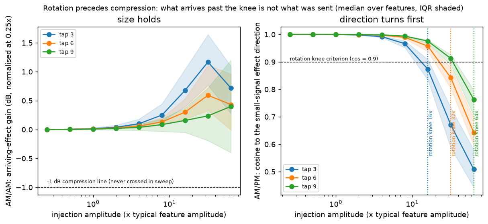
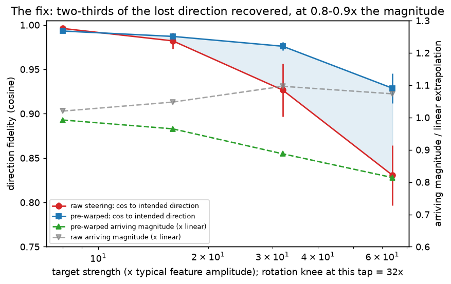
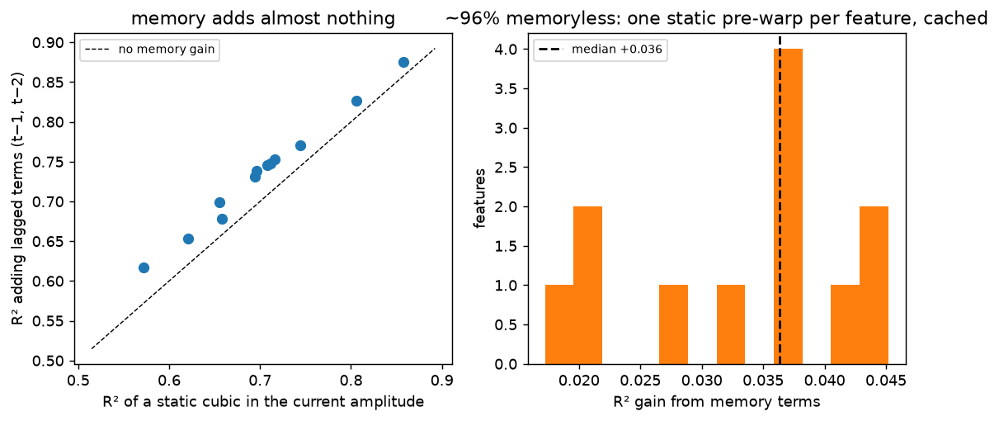
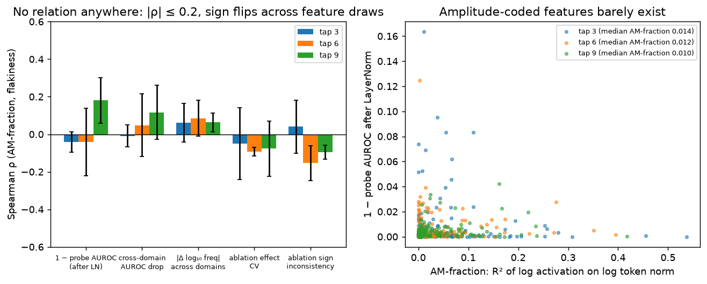

# Improving Steering Vectors with Predistortion

> **A human disclaimer.** The AI has produced stunning achievements in applied
> mathematics. I found myself between jobs for a weekend, so I decided to join the AI
> research train before I became busy again. I directed Claude Fable to work on an old idea of mine
> from the pre-transformer days, whether DNNs are some form of communication channel,
> in the EE sense. The answer appears to be a conditional yes. Too bad too many years have passed
> and I can no longer fully judge its work, but here it is. — ivanamies

**TL;DR.** Steering fails like a satellite amplifier: past a measurable knee the vector arrives at
full size pointing the wrong way — rotation precedes compression, for 100% of directions tested, on
every model tested. Measure the distortion curve once per feature, invert it upstream: cosine
0.83→0.93 at 64×. Cacheable, because the channel is ~96% memoryless.

## Notation, units, and the cast

- **Tap N** = the residual stream read just after block N of GPT-2-small (12 blocks; taps 3/6/9 =
  quarter/half/three-quarter depth). The stream, the wire, and the channel are the same object.
- **Amplitude units:** multiples of a feature's median non-zero activation (its typical operating
  strength). dB = 10·log₁₀(power ratio).
- **AM/AM and AM/PM:** an amplifier's measured curves — input amplitude → output amplitude, and
  input amplitude → output phase. Here "phase" is direction: the arriving effect's cosine to the
  linearly-extrapolated effect direction. The **knee** is where a curve leaves its linear region.
- **Seeds:** independent redraws of the probe (feature or direction draws) on a frozen model —
  nothing is retrained. Three seeds unless a deviation is stated (§4's table is one seed, stated).
- **AM-fraction:** the R² of a direction's log-activation on log token norm — how much of its
  signal rides the stream's loudness rather than its direction.
- **Acronyms:** SAE — sparse autoencoder (the direction dictionary); DPD — digital predistortion;
  Volterra — a polynomial model with memory (lagged terms); NLL — negative log-likelihood.

## 0. Background and prior work

Activation steering — adding a direction to the residual stream to change behavior — is standard
practice [2, 3] and standardly unreliable, with no mechanism attached to the folklore "strong
steering makes the model weird." The machinery this paper borrows is the satellite tradition:
travelling-wave-tube amplifiers distort both amplitude (AM/AM) and phase (AM/PM) near saturation,
are characterized by those two measured curves [6], and are corrected by digital predistortion —
pre-warping the transmitted signal by the measured inverse, with memory-polynomial extensions when
the amplifier's past matters [7]. Feature directions come from a pinned public sparse-autoencoder
release [4, 5]. The channel datasheet this paper consumes — the linearity budget and noise
statistics — is from the companion paper [1], measured on the same model and corpus. LayerNorm, the
normalizer whose amplitude-destruction motivates the refuted competing account of Appendix A, is
[8]. Models and corpora: GPT-2 [9a], Pythia [9b], Qwen2.5 [9c], TinyStories [9d].

## 1. What this paper establishes

| claim | where |
|---|---|
| Past a per-model knee, an injected direction arrives at roughly full size but rotated — rotation precedes compression, 100% of directions, every model tested | §3, §7 |
| A classical memoryless predistorter recovers about two-thirds of the lost direction fidelity, trading size for direction | §4 |
| The correction is cacheable: feature-scale nonlinearity is ~96% memoryless | §5 |
| Almost nothing on this wire rides the token norm — the stream is FM by construction, across seven direction families | §6 |

## 2. The budget this paper consumes

**Claim.** Two facts are prerequisites taken from the companion datasheet [1], not contributions:
the two-tone linearity budget (intermodulation <10% up to 3× typical feature amplitude at taps 3/6,
10× at tap 9) and the noise the sweep is read against (heavy tails; stream norms 67/88/157 setting
the units — amplitudes below are multiples of each feature's median non-zero activation).

**Method.** None here — imported measurements. See [1] §2.

**Controls.** Not applicable — no measurement is made in this section. The load-bearing caveat is a
distinction, not a control: **the two-tone budget binds multi-tone experiments; a single steering
vector is a single tone**, whose headroom runs out at the rotation knee of §3, much further out.
The two budgets (3×/10× vs 16×/32×/64×) are separate; a reader with one number in mind probably has
the wrong one.

**Result.** No result — imported. Raw data: `artifacts/results/wire_datasheet.json`.

**Scale & generality.** Inherited from [1]: GPT-2-small, 3 seeds.

**Plainly.** Before pushing on the system, we look up its spec sheet, measured earlier: how hard you
can push before it stops responding proportionally, and what the background noise looks like. One
warning: the spec has two different limits — one for injecting several things at once, one for
injecting a single thing hard — and this paper lives under the second.

## 3. The mechanism: rotation precedes compression

**Claim.** Sweeping injection strength per direction, the arriving effect's *gain* stays within
1 dB out to 64× typical amplitude while its *direction* rotates away, crossing cosine 0.9 at
16×/32×/64× at taps 3/6/9 — later with depth, cleanly scaling. For 100% of features tested, the
rotation knee arrives before the compression knee. This ordering is the mechanism of "strong
steering goes weird rather than weak": past the knee the intervention that arrives is not the one
that was sent.

**Method.**
- Inject α·u at a tap (u a unit decoder direction), read the arriving effect three blocks
  downstream: magnitude relative to the linear extrapolation from small α (the AM/AM curve) and
  cosine to the linearly-extrapolated effect direction (the AM/PM curve, phase in the only sense a
  real vector space has): `ecc_repr/dpd.py::datasheet` (L90), injector `dpd.py::_Inject` (L66).

**Controls.** *Positive:* the instrument must detect saturation where saturation must exist — the
companion two-tone test at 100× shows intermodulation 0.41 on the same machinery [1]. *Negative:*
below the knee, cosine must sit at ~1 and gain at ~1× (no distortion where none should be) — it
does; this is also §4's below-knee row. *Loading:* amplitudes in per-feature median-activation
units; the linear extrapolation from small α is the common reference every curve is read against;
identical features and contexts across amplitudes.

**Result.** Gain within 1 dB to 64×; cosine-0.9 crossings at 16×/32×/64× for taps 3/6/9; rotation
first for 100% of features. Raw data: `artifacts/results/dpd_datasheet.json`.

**Scale & generality.** GPT-2-small, 3 seeds, 40 features per draw, taps 3/6/9. The ordering — not
the knee locations — replicates across models (§7).

**Images.** 
`ecc_repr/figs_papers.py::p2_f1_mechanism` (L47); regenerate `steering-predistortion/build.sh`.

**Plainly.** Push a steering vector harder and the model doesn't ignore you — it does something
else. We found out why: the stream keeps the *size* of your push almost intact far past the point
where it stops keeping the *direction*. Like shouting through a bullhorn that stays loud but
slowly turns to point somewhere else, the failure isn't weakness — it's aim.

## 4. The fix: a memoryless predistorter

**Claim.** The classical corrector transfers: invert the measured AM/AM by interpolation for
amplitude; for direction, pull the leakage (the arriving component orthogonal to the intent) back
through the Jacobian and apply it with a measured line search. It recovers roughly two-thirds of
the fidelity lost past the knee — cosine 0.831→0.929 at 64×, 0.927→0.976 at 32× — at a price paid
in the other currency: the pre-warped effect arrives at 0.81–0.89× the linear extrapolation.
Below the knee it slightly hurts (0.996→0.993 at 8×) and should be switched off; the crossover is
at 16×.

**Method.**
- Amplitude half: interpolation on the measured AM/AM curve; direction half: one backward pass,
  J^T·leakage, line-searched: `ecc_repr/dpd.py::memoryless_dpd` (L146), gradient tap
  `dpd.py::_GradTap` (L36).
- Computed once per feature and cached (§5 is why that is legitimate).

**Controls.** *Positive:* above the knee the corrector must improve fidelity, and does (every row
past 16×). *Negative:* below the knee there is no distortion to invert, so the corrector must not
help — measured: it slightly hurts (0.996→0.993), because what it applies there is its own
approximation error. This row was once published interpolated rather than measured; it is now
rebuilt from the raw JSON and not re-smoothed (Appendix A). *Loading:* raw and pre-warped compared
at the same amplitude targets on the same features; the arriving-magnitude column is reported so
nobody compares "the same α" across two different interventions.

**Result.**

| amplitude | raw cosine | pre-warped | arriving magnitude |
|---|---|---|---|
| 8× | .996 ±.002 | .993 ±.002 | 0.99× |
| 16× | .982 ±.009 | .987 ±.003 | 0.97× |
| 32× | .927 ±.031 | **.976** ±.005 | 0.89× |
| 64× | .831 ±.036 | **.929** ±.018 | 0.81× |

Raw data: `artifacts/results/dpd_memoryless.json`.

**Scale & generality.** Tap 6, 12 features, **one seed** — a stated deviation from the program's
3-seed standard; the ± spreads are across features, not seeds. The corrector uses one backward pass
and a measured line search, not an exact inverse, so "two-thirds recovered" is a property of this
corrector, not an upper bound. Fitted and evaluated on GPT-2 only (§7). Downstream *behavioral*
evaluation — does the model actually do the intended thing more often — is not measured; the
fidelity metric is a proxy.

**Images.** 
`figs_papers.py::p2_f2_fix` (L82); regenerate `steering-predistortion/build.sh`.

**Plainly.** Satellite engineers can't repair an amplifier in orbit, so they measure how it distorts
and send a pre-distorted signal that arrives correct. Same recipe here: measure how the model bends
your steering vector, bend it the opposite way first. You get back most of the lost aim, paying
with a somewhat smaller push — usually the right trade, since push size is the knob you already
control. And below the bending point, turn the corrector off: there's nothing to fix there.

## 5. Why it caches: the memory gate stays shut

**Claim.** The pre-warp is compute-once-per-feature cacheable because feature-scale nonlinearity is
~96% memoryless: refitting the arriving effect with lagged (Volterra) terms adds only +0.036 R²
over a static cubic.

**Method.**
- Amplifier engineering's standard test [7]: fit static polynomial, refit with lagged diagonal
  Volterra terms, report the gap: `ecc_repr/dpd.py::memory_test` (L235).

**Controls.** *Positive:* missing (acknowledged) — no synthetic channel with known memory was run through the
fitter to confirm it detects memory when memory exists. *Negative:* not applicable beyond the
static fit itself serving as the no-memory reference. *Loading:* same features, same residuals,
both fits scored on the same data — with the honest weakness that the score is raw ΔR², with no
held-out split and no parameter penalty; finishing this properly (a scored model-order ladder) is
registered follow-up work in `steering-predistortion/NOTES.md`.

**Result.** +0.036 R² median for lagged terms. Raw data: `artifacts/results/dpd_memory_test.json`.

**Scale & generality.** Tap 6, 12 features, 3 seeds, GPT-2 only; the gate must be re-checked per
model — where history matters, compute-once-and-cache does not hold.

**Images.** 
`figs_papers.py::p2_f3_memory` (L111); regenerate `steering-predistortion/build.sh`.

**Plainly.** The correction is only cheap if it doesn't depend on what the model was just thinking
about. We checked: letting the fit peek at recent history barely improves it. So one correction
table per feature, computed once, works everywhere — like a printed lens prescription instead of
glasses that need refocusing every minute.

## 6. The wire is FM

**Claim.** Almost nothing on this wire rides the token norm: across seven direction families that
share no origin — the dictionary's decoder and encoder directions, isotropic random directions,
high and low principal components, the model's own unembedding rows, and mean-difference steering
vectors — the median AM-fraction (R² of log-activation on log token norm) sits in a narrow
0.001–0.038 band. Amplitude is not a carrier on this stream; the claim covers steering directions
generally, not dictionary features specifically.

**Method.**
- AM-fraction census on dictionary features: `ecc_repr/census.py` (save at L196).
- The seven-family generalization, chosen so no two families share a prior:
  `ecc_repr/amfm_dirs.py` (save at L153).

**Controls.** *Positive:* the dictionary's decoder directions — if a dictionary trained on a
normalised stream were structurally blind to amplitude coding, its directions would be uniquely
*low*; they are the **highest** family at every tap, which refutes the instrument-reading (this is
the measurement that converts "we measured our SAE" into "we measured the model"). *Negative:*
low-variance principal components and random directions bound the floor (0.001–0.018). *Loading:*
100 directions per family per draw, same taps, same statistic, same corpus.

**Result.**

| tap | decoder | encoder | random | PCA hi | PCA lo | unembed | mean-diff |
|---|---|---|---|---|---|---|---|
| 3 | .038 | .013 | .018 | .033 | .025 | .021 | .033 |
| 6 | .037 | .014 | .012 | .017 | .015 | .015 | .029 |
| 9 | .018 | .008 | .004 | .001 | .001 | .020 | .024 |

One qualifier the median hides: the decoder family's 90th percentile is 0.20–0.24 — a minority of
dictionary directions do carry real amplitude dependence; check the specific feature before
building on it. And one scope line, so this claim is not quoted against a different one:
"amplitude" here means the token's **total** norm — global loudness. Whether individual *writers'*
output amplitudes carry information is a different observable, and the program's follow-up
measurements (not part of this snapshot) find that they do, heavily: the stream is
amplitude-modulated per sender and level-normalized in aggregate. "FM" is shorthand for the second
half only. Raw data: `artifacts/results/census_amfm.json`, `census_amfm_dirs.json`.

**Scale & generality.** GPT-2, 3 seeds (3 disjoint 100-direction draws per family), taps 3/6/9.
The registered prediction this census was built to test — and refuted — is in Appendix A.

**Images.** 
`figs_papers.py::p2_f4_amfm` (L135); regenerate `steering-predistortion/build.sh`.

**Plainly.** Radio can carry information in loudness (AM) or in frequency (FM). FM won because
noise jostles loudness easily. This network's normalizers erase loudness at every layer — and when
we went looking for signals that ride loudness anyway, we found essentially none, no matter what
kind of direction we probed with. The stream is FM. That matters here because it kills the obvious
rival explanation for flaky steering.

## 7. Generalization

**Claim.** The ordering — rotation before compression — replicates on every model and every
direction tested; the knee *locations* (8× to 24×) are per-model constants and do not transfer.

**Method.**
- Dictionary-free census: sweep principal-component directions, inject at quarter depth, read at
  three-quarter depth, locate both knees: within `ecc_repr/generalize.py::run` (L625), steering
  group.

**Controls.** *Positive:* the GPT-2 anchor inside the roster pipeline reproduces §3's single-model
result. *Negative:* not applicable — there is no known model without the ordering to serve as one;
the closest thing is the prediction's falsifiability per row (any model showing compression first
would break the 100%). *Loading:* corpus size held identical across models; 12 principal-component
directions per model; same depth fractions.

**Result.**

| model | family | rotation knee | rotation first? |
|---|---|---|---|
| GPT-2 small | GPT-2 | 8× | 100% |
| Pythia-70m | Pythia | 16× | 100% |
| Pythia-160m | Pythia | 8× | 100% |
| Pythia-410m | Pythia | 16× | 100% |
| Qwen2.5-0.5B | Qwen | 24× | 100% |

Knees interleave across the serial/parallel architectural split — the point-to-point layer is
universal where the companion paper's multiple-access layer is architectural. Raw data:
`artifacts/results/dpd_datasheet.json`, `generalize_e3.json`.

**Scale & generality.** Five models, three families, including grouped-query attention and a
different tokenizer. What does NOT generalize: the pre-warp itself, its recovered fidelity, the
magnitude trade, and the memory gate — all single-model numbers needing per-model re-measurement.

**Images.** None — the table above is the result.

**Plainly.** The *phenomenon* — aim fails before strength fails — shows up in every network we
tried, including ones built quite differently. But the *numbers* (where exactly the knee sits) are
like a particular amplifier's serial-numbered calibration sheet: measure your own before using any
of this.

## 8. Predictions graded

Registered before the runs. (1) Rotation precedes compression — **confirmed**, 100% of features.
(2) Knee locations layer-uniform — **resolved** as layer-uniform with clean depth scaling. (3)
AM-fraction predicts flakiness — **refuted**; Appendix A. (4) Memoryless enough to cache —
**confirmed** (+0.036 R²).

**Plainly.** We wrote down four bets before running anything. Two won, one needed a sharper
wording, one lost — and the loss is reported with the same volume as the wins, in the appendix.

---

## Appendix A — refuted predictions and corrected records

- **"AM-fraction predicts flakiness" — refuted, as an absence.** The registered prediction: features
  that encode information in amplitude (which LayerNorm destroys [8]) should be the fragile ones.
  Measured: median AM-fraction 0.010–0.017 (90th percentile ≈0.1); probes reading the normalised
  stream lose nothing against raw (0.998 vs 0.998, cross-domain transfer 0.99); every Spearman
  correlation between AM-fraction and a flakiness proxy is |ρ| ≤ 0.2 with seed spread as large as
  its mean. There is no AM population to be fragile. (GPT-2, 100 features per draw, 3 draws per
  tap; `census_amfm.json`.)
- **The instrument-reading of that refutation — also refuted.** "SAEs trained on a normalised
  stream can only find directional features, so we measured our dictionary, not the model" would
  predict the dictionary's directions are uniquely low in AM-fraction. They are the highest family
  of seven (§6). The refutation is about the model.
- **A corrected record.** The §4 table was once published with interpolated rather than measured
  rows. It is rebuilt from `dpd_memoryless.json`; the real data shows the pre-warp *hurts* below
  the knee (0.996→0.993 at 8×), single-seed and declared as such. It is not to be re-smoothed.

## References

[1] *Serial Residual Streams Are a Multiple-Access Channel.* Companion paper, this repository
(`multiple-access-channel/SURVEY.md`). Supplies the wire datasheet and the two-tone linearity budget of §2.
[2] Turner et al. *Activation Addition: Steering Language Models Without Optimization.* 2023.
[3] Zou et al. *Representation Engineering.* 2023.
[4] Bricken, Templeton, et al. *Towards Monosemanticity: Decomposing Language Models with Dictionary Learning.* Anthropic, 2023.
[5] Bloom. *Open-source residual-stream SAEs for GPT-2-small* (`jbloom/GPT2-Small-SAEs-Reformatted`). 2024.
[6] Saleh. *Frequency-Independent and Frequency-Dependent Nonlinear Models of TWT Amplifiers.* IEEE Trans. Communications, 1981.
[7] Morgan, Ma, Kim, Zierdt, Pastalan. *A Generalized Memory Polynomial Model for Digital Predistortion of RF Power Amplifiers.* IEEE Trans. Signal Processing, 2006.
[8] Ba, Kiros, Hinton. *Layer Normalization.* 2016.
[9] (a) Radford et al. *Language Models are Unsupervised Multitask Learners* (GPT-2). 2019. (b) Biderman et al. *Pythia.* 2023. (c) Qwen team. *Qwen2.5 Technical Report.* 2024. (d) Eldan, Li. *TinyStories.* 2023.

## Appendix B — operational notes

- **Provenance.** Experiments, code, and this document by Claude (Fable 5), directed by ivanamies,
  who set the framing, the failure criteria ("kill bars"), and the editorial policy. Predictions
  were registered — committed to git in `plans_*.md` and `steering-predistortion/NOTES.md` — before results.
- **This file is the paper.** `main.tex` and `main.pdf` are generated from it by
  `scripts/md2tex.py` (run by `steering-predistortion/build.sh`). Both are machine-checked against manifests
  (the manifests) by `tests/test_paper_manifests.py`.
- **Code references.** `module.py::function` (LNN) pointers are for repository readers; line
  numbers are as of this commit. `MAP.md` is the section → JSON → module index; `REPRODUCE.md`
  covers reproduction.
- **Figures.** `survey_figs/*.png` are committed so this page renders on GitHub — the repository's
  documented exception; sources of truth are the regenerating scripts and `artifacts/figdata/`.
- **The repository name.** `ecc_repr` names the program's first arc (error-correcting codes on
  learned representations); this paper inherits the name and contains no error correction.
- **Section template.** Claim; prior-work anchors; method bullets with code; positive/negative/
  loading controls ("not applicable" and "missing (acknowledged)" allowed); result with raw data;
  scale & generality; images; a plain-language passage. Refuted predictions in Appendix A.
