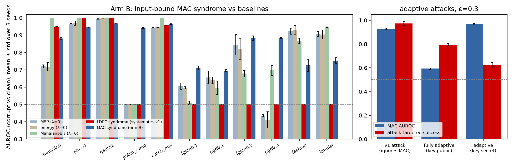
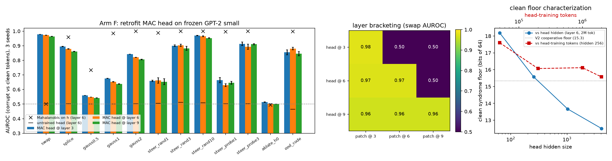
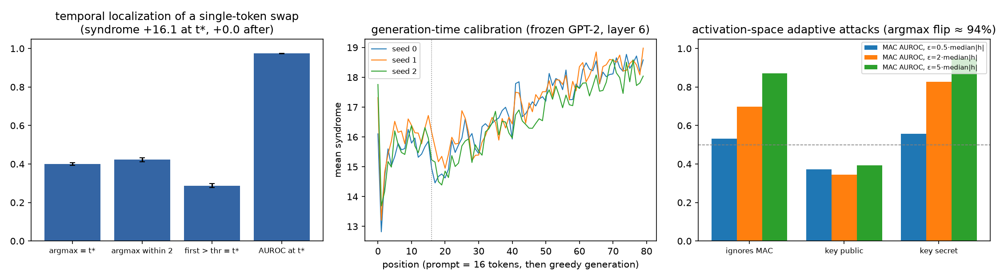
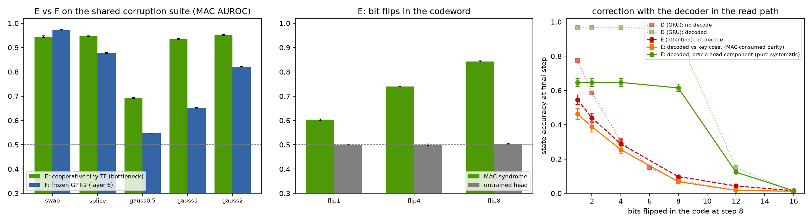
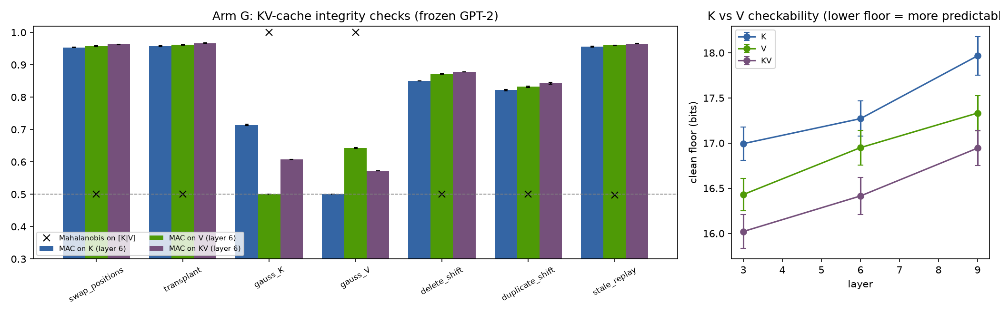
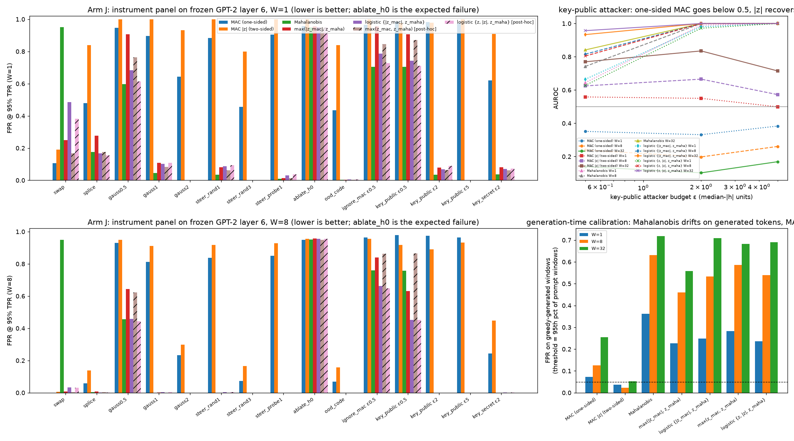
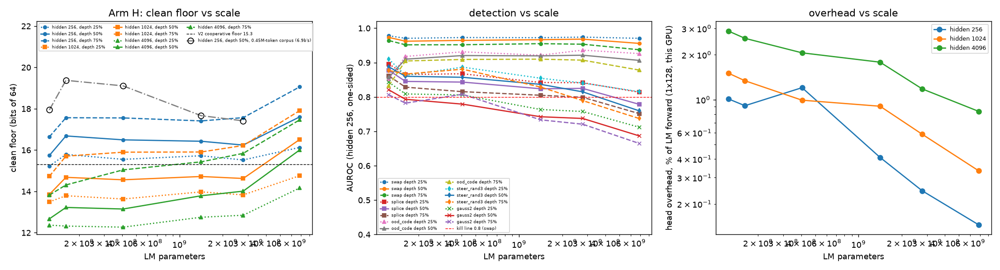
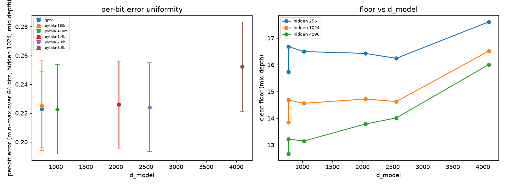

# A Tamper Seal for Neural Networks

> **A human disclaimer.** The AI has produced stunning achievements in applied
> mathematics. I found myself between jobs for a weekend, so I decided to join the AI
> research train before I became busy again. I directed Claude Fable to work on an old idea of mine
> from the pre-transformer days, whether DNNs are some form of communication channel,
> in the EE sense. The answer appears to be a conditional yes. Too bad too many years have passed
> and I can no longer fully judge its work, but here it is. — ivanamies

**TL;DR.** A 213k-parameter head bolted onto a frozen LM — no fine-tune, no gradients into the
model — makes activation and KV-cache integrity a calibrated runtime check: swapped, replayed, or
transplanted state caught at 0.96–0.98 where Mahalanobis sits at chance, windowed false-alarm rate
0.000 at 8-token windows, flat from 124M to 6.9B parameters, ≤1% overhead on a server GPU. It
authenticates the state; it does not judge the computation.

## Notation, units, and the cast

- **Tap N** = the residual stream read just after block N; on GPT-2-small (12 blocks) taps 3/6/9
  are quarter/half/three-quarter depth. The **KV cache** is the per-layer store of attention keys
  and values that serving stacks keep between tokens.
- **The seal**: a 2-layer MLP head (256 hidden, 213k parameters; 426k for the KV variant) reading
  one tapped vector and trained to predict a **key** — the sign pattern of a frozen *random* causal
  function of the token prefix (random embedding into a frozen random GRU, median-binarised to 64
  balanced bits, then a fixed permutation and mask). The **syndrome** of a token is the number of
  the 64 key bits the head gets wrong. The **clean floor** is the syndrome's mean on untampered
  traffic; detection is the corrupted syndrome standing above it. MAC = message authentication
  code: a check binding data to a key so a mismatch with *this* context is detectable.
- **Seeds**: head initialisation + key net; the LM is frozen and never reseeded. 3 seeds, mean ±
  std, everywhere except one labelled MNIST table.
- **Reporting**: AUROC (probability a corrupted token outscores a clean one) and FPR@95%TPR (false
  alarms at 95% recall); every table carries a **Mahalanobis** baseline (distance from the clean
  activation distribution — the standard anomaly detector) on the same activations and an
  **untrained-head control**.
- **Threat models**, reported for every instrument: *key-ignorant* (attacker optimises its goal,
  ignores the seal), *key-public* (attacker adds beating the seal to its loss), *key-secret*
  (attacker optimises against its own guessed key).
- **W** = window size: per-token syndromes averaged over W consecutive tokens before thresholding.

## 0. Background and prior work

Message authentication codes are standard cryptographic practice [10]; this paper's construction
is a MAC in the ordinary sense — bind state to a keyed function of context, alarm on mismatch —
built from learned parts. The designed-code prehistory uses LDPC codes [11] trained toward via
soft-parity products in the style of learned decoding [12], straight-through sign binarisation
[13], and the E8 lattice [14]. Baselines are the standard out-of-distribution detectors:
max-softmax probability [15], the energy score [16], and Mahalanobis distance [17]; input-space
attacks are FGSM [18] and PGD [19]. The corruption this seal is built for — replacing a residual
vector wholesale — is the *activation patching* operation of interpretability practice [20], read
here as an attack surface rather than a method. KV caches as first-class serving state, and hence
as a thing worth sealing, follow the serving literature [21]. The reading-side theory — why a
small head can despread a random causal hash from a frozen stream at all — is the companion
paper's despreading measurement [1]. Models and corpora: GPT-2 [22a], Pythia [22b], TinyStories
[22c].

## 1. What this paper establishes

| claim | where |
|---|---|
| A designed code on a small encoder shows what a syndrome can and cannot see: channel corruption yes, valid-but-wrong state no — the blind spot a key fixes | §2, §3 |
| A head trained after the fact on a frozen LM detects swapped residuals at 0.964–0.978 (FPR95 0.09–0.14) with exact layer and token localisation, no LM gradients | §4 |
| Training the model *with* the seal from scratch adds ≈ nothing over the retrofit | §5 |
| The KV cache is checkable: transplant/replay/moves at 0.95–0.97 | §6 |
| Keep two instruments (MAC + Mahalanobis); add a two-sided term only for the below-floor attacker | §7 |
| The numbers are scale-flat from 124M to 6.9B, and the floor is the stream's, not the reader's | §8 |
| Deployment shape: a windowed integrity monitor — FPR 0.000 at W=8 on every replacement-type corruption | §9 |

## 2. Design lessons from a designed code

**Claim.** On a small trained-from-scratch encoder whose 128-bit representation is made to lie on
a rate-1/2 LDPC code, the syndrome (count of violated parity checks) is a near-perfect detector of
*channel* corruption (noise on the representation, spliced coordinates: 0.95–1.00) and structurally
blind to *valid-but-wrong* state: replacing the whole vector by another input's clean vector scores
exactly 0.500 — for the syndrome and for every baseline. Also: gradient descent cannot push a code
onto the check matrix through a soft-parity loss (plateaus at 92–95% of checks; trapping-set-like
local minima), while a systematic encoder — parity bits computed from information bits by
construction — is on the code at 100% with baseline task accuracy (99.02% vs 98.94%).

**Method.**
- Code: rate-1/2 LDPC, n=128, girth ≥6, greedy progressive-edge-growth construction:
  `ecc_repr/codes.py::make_H` (L64); systematic encoding via GF(2) row reduction
  (`codes.py::information_set`).
- Soft-parity training and the systematic variant: `ecc_repr/model.py`, `ecc_repr/train.py`;
  detector battery: `ecc_repr/eval.py`.
- Unit tests: sign/bit map, a hand-computed check, hard-vs-soft syndrome agreement, the min-sum
  decoder (`tests/test_codes.py`).

**Controls.** *Positive:* Mahalanobis at 1.000 on Gaussian representation noise — the battery
detects what must be detectable; the systematic encoder's clean syndrome is identically 0
(validity by construction, verified). *Negative:* the patch-swap row — 0.500 for every detector —
is the structural null this section exists to exhibit. *Loading:* all detectors score the same
corrupt-vs-clean test sets on the same models.

**Result.** As stated in the claim; the full detector table is in the paper's Table 1. Raw data:
`artifacts/results/rung1.json`, `rung3.json`, `rung3_lam10.json`.

**Scale & generality.** MNIST, two-conv encoder; the detector table is single-seed (its 3-seed
replication is in the repository); the systematic-vs-soft-parity comparison is 3 seeds. These are
*design lessons from a small system*, explicitly not evidence about language models (§11) — they
motivate the construction the rest of the paper tests where it matters.

**Images.** None dedicated — the section's deliverable is its table and the two lessons.

**Plainly.** We first built a toy system where the internal code was designed by hand, like a
checksum on a file. The checksum catches static and scrambling perfectly — but if you swap the
whole file for a different valid file, every checksum passes. That blind spot isn't a bug you can
train away; it's what checksums are. Catching a swap needs the check to depend on *which input
this was supposed to be* — a key. That is the next section.

## 3. The MAC: input-bound parity

**Claim.** Making the parity half key-dependent — parity must match a fixed random function of
*this* input — moves whole-vector patch swap from the structural 0.500 to 0.942 ± 0.003 (kill
criterion was ≤0.7), at −0.13% task accuracy. The check equals the head's key-prediction error
(zero iff exact; hand-verified). The clean floor is 15.3 ± 0.2 of 64 bits and does not move with
head capacity or epochs — the certificate is statistical, not exact.

**Method.**
- Key: frozen random 2-conv net, per-feature median binarisation (balanced bits), fixed
  permutation+mask; coset check `syndrome_MAC = H·bits(sign z) ⊕ H_par·f(k(x))`:
  `ecc_repr/mac.py::syndrome_mac` (L62), model `mac.py::MACSystematicNet`.
- Suite and threat models: `ecc_repr/arm_b.py`, `ecc_repr/attacks.py`.

**Controls.** *Positive:* the coset algebra is unit-tested against a hand computation; the kill
criterion (≤0.7 on swap) is beaten at 0.942. *Negative:* the untrained-head column sits at
0.455–0.527 across the entire suite — the binding is learned, not an artifact of input-dependent
bits. *Loading:* identical corruptions and baselines as §2's table, same encoders.

**Result.** Swap 0.942; non-adaptive input attacks and out-of-distribution inputs move from the
structural 0.500 to 0.70–0.88 and 0.73–0.75. Threat models: key-ignorant flagged at 0.927 (though
its attack still succeeds 97% of the time — detection is not prevention); key-public cuts
detection to 0.593; key-secret 0.970. Raw data: `artifacts/results/arm_b.json`,
`rung3_mac_b3_seed{0,1,2}.json`, `rung3_mac_untrained_seed{0,1,2}.json`,
`adaptive_mac_mac_b3_seed{0,1,2}.json`.

**Scale & generality.** MNIST, 3 seeds. A sidebar measured on the same testbed: an E8-lattice code
the network sits *near* (not on) is the best all-round anomaly detector (0.94–0.99 across the
suite) but still 0.500 on swap — "near the code" is what a detector wants, "on the code" is what a
MAC needs (`lattice_sweep.json`, `lattice_post.json`).

**Images.** 
Reused via the figure map in `ecc_repr/figs_dist.py` (L49); regenerate `tamper-seal/build.sh`.

**Plainly.** The fix for the checksum's blind spot is the same one banks use: don't just check
that the message is well-formed, check that it matches a secret stamp computed from the context it
claims to belong to. With the stamp in place, swapping in a perfectly valid state from somewhere
else finally trips the alarm — because it carries the wrong stamp.

## 4. A post-trained MAC head on frozen GPT-2

**Claim.** The commercially meaningful version: **the model is never touched.** A 213k-parameter
head trained on activations read out of a frozen GPT-2 — no LM gradients, weights byte-identical
before and after — detects a swapped residual (the activation-patching operation) at AUROC
0.964–0.978, FPR@95%TPR 0.09–0.14, at every layer tried. Localisation is exact in both axes: a
head at layer ℓ fires iff the intervention is at m ≤ ℓ, and a single swapped token raises the
syndrome by 16.1 bits at that token and 0.0 afterwards. The clean floor (15.2–16.6 bits) equals
the cooperative floor (15.3, §2–3's from-scratch system) — retrofit loses nothing.

**Method.**
- Key: frozen random causal GRU over tokens (incremental = offline, unit-tested — computable
  during generation): `ecc_repr/seq_key.py`.
- Head training on cached activations and the corruption suite (swap/splice/gauss/steer/ablate,
  injected by forward hooks at layer m, positions ≥32): `ecc_repr/arm_f.py::train_head` (L34),
  `arm_f.py::run_with` (L88); floor/temporal/generation/adaptive extras: `ecc_repr/arm_f_extras.py`.

**Controls.** *Positive:* the kill criterion (0.7 on swap) beaten at 0.964–0.978; layer bracketing
must show a step, and does ([.98,.50,.50; .97,.97,.50; .96,.96,.96]). *Negative:* the untrained
head is 0.50 everywhere; Mahalanobis is 0.500 on swap — the measured proof that a swapped
activation is a perfectly typical activation, i.e. the task is authentication, not anomaly
detection. *Loading:* all detectors read the same activations; 3 seeds = head + key init on the
fixed LM; corpus 2M TinyStories training tokens, 200k disjoint evaluation.

**Result.** As claimed; additionally: per-bit error is uniform (0.16–0.24 — no unlearnable bit);
capacity moves the floor (18.2→12.5 from hidden 64 to 4096) while corpus size barely does
(17.6→15.6 from 50k to 2M); the floor is stable at generation time (15.4–16.0 prompt, 16.7–17.2
greedy-generated). Adaptive attacks in activation space are the limitation: ε=0.5 nudges pass
unseen (0.532), ε=2/5 partially caught (0.70/0.87), and the key-public attacker drives the
syndrome *below* the clean floor — §7's two-sided statistic exists for exactly that. Raw data:
`artifacts/results/arm_f.json`, `arm_f_agg.json`, `arm_f_floor.json`, `arm_f_temporal.json`,
`arm_f_generation.json`, `arm_f_adaptive*.json`.

**Scale & generality.** Frozen GPT-2-small, 3 seeds; overhead 7–11% of the LM forward on Apple
MPS, ≤1% on a server GPU (§8, where the numbers also reproduce to within 0.005 AUROC across
hardware). OOD evaluation: Python source (0.85–0.88).

**Images.** 

Reused via `figs_dist.py` (L49–50); regenerate `tamper-seal/build.sh`.

**Plainly.** You can clip a tiny security camera onto a language model that's already deployed —
no retraining, no surgery, the model computes exactly what it computed before. The camera learns
to predict a secret fingerprint of the conversation so far from the model's internal state. Swap
that state for another conversation's — the standard way internals get edited — and the
fingerprint stops matching, and the camera can tell you *which layer* and *which token*. The
standard anomaly detector scores this swap at exactly chance, because the swapped state is
perfectly normal — it's just someone else's.

## 5. The cooperative control

**Claim.** Training the model *with* the seal from the start adds ≈ nothing for detection: on the
shared suite, swap is 0.944 (cooperative) vs 0.973 (frozen retrofit); the cooperative model's only
edge (+0.13–0.28 on Gaussian noise) comes from its bottleneck signs *being* the noised object.

**Method.**
- A 4-block decoder-only transformer (d=256) on a 256-state automaton-tracking task with the
  systematic+MAC bottleneck after block 3: `ecc_repr/arm_e.py`, bottleneck from
  `ecc_repr/fsm.py`/`mac.py`.

**Controls.** This section *is* a control — the from-scratch comparison arm for §4. *Loading:*
shared corruption suite, matched reporting; untrained heads 0.50 throughout. *Positive/negative:*
inherited from §4's suite on both arms.

**Result.** E−F ≈ 0 where it matters. Raw data: `artifacts/results/arm_e.json`, `arm_f_agg.json`.

**Scale & generality.** One small from-scratch testbed; the conclusion is a delta, not an absolute.

**Images.**  — reused via
`figs_dist.py` (L50); regenerate `tamper-seal/build.sh`.

**Plainly.** Would the seal work better if the model grew up wearing it? No. The bolt-on camera
sees essentially everything the built-in one sees. That matters commercially: nobody has to
retrain anything to get this.

## 6. KV-cache integrity

**Claim.** The one place a transformer's memory corruption is literal — the KV cache — is
checkable by the same recipe: heads on the flattened K, V, or [K|V] of one layer (plus fixed
sinusoidal slot features, standardised inputs) detect cross-prompt transplant at 0.95–0.97, stale
replay 0.95–0.97, position swap 0.95–0.97, delete/duplicate-shifts 0.81–0.91. Mahalanobis on the
same tensors: 0.500 on transplant. Floors 16.0–18.0 bits; K and V equally checkable, [K|V] best.

**Method.**
- Cache extraction, prefix-bound targets, slot features, the 7-corruption suite:
  `ecc_repr/kv_mac.py::arm_g` (L140).

**Controls.** *Positive:* kill criterion (0.7 on transplant) beaten at 0.95–0.97. *Negative:*
untrained heads 0.50; Mahalanobis 0.500 on transplant; **two kept nulls** — designs that XOR a
random per-slot mask into the target are unlearnable for a shallow head (floor = chance) and are
retained on disk rather than deleted (Appendix A). *Loading:* corruptions act on cache tensors at
positions ≥32; same reporting battery.

**Result.** As claimed. Because a cache entry is read many times, the 6 µs-per-cached-token head
cost amortises. Raw data: `artifacts/results/arm_g.json` (nulls: `arm_g_nopos.json`,
`arm_g_posmask.json`).

**Scale & generality.** Frozen GPT-2, layers 3/6/9, 3 seeds; Gaussian noise on K or V remains the
weak class (0.5–0.86) — the Mahalanobis companion's job, as in §4.

**Images.**  — reused via `figs_dist.py`
(L51); regenerate `tamper-seal/build.sh`.

**Plainly.** Serving systems keep a scratchpad of everything the model has read so far and reuse
it between requests. If someone swaps your scratchpad for another user's, replays a stale one, or
shifts its rows, the model happily continues — and the anomaly detector sees nothing, because
every entry is individually normal. The sealed check catches all of it, because each entry has to
match *this* conversation's fingerprint at *that* position.

## 7. Two instruments beat one fused score

**Claim.** The MAC and Mahalanobis are complements — the MAC owns replacement-type corruptions
(where Mahalanobis is 0.500), Mahalanobis owns off-manifold ones (noise, steering, OOD, where the
MAC is 0.55–0.97) — and the right deployment is both, max-combined after z-scoring, **not** a
single fused score. A two-sided syndrome statistic |z| earns its place for one adversary only: the
key-public attacker who drives the syndrome *below* the clean floor (12.2–13.2 vs 15.7), where
one-sided AUROC collapses to 0.10–0.35 and |z| recovers 0.72–0.84 at W=32. Thresholds set on
prompt tokens do not transfer to generated tokens; one calibration pass (~250 generated sequences
per model × decoding setting) fixes it.

**Method.**
- Fusion (pre-registered logistic on {|z_MAC|, z_Mahal}, fit/eval on disjoint halves; max-rule as
  the no-fit baseline; two post-hoc variants labelled as such): `ecc_repr/fuse.py`.
- Generation-time calibration (500 prompts × 64 greedy tokens; prompt-set vs generation-set
  thresholds and standardisation): `ecc_repr/gencal.py`.

**Controls.** *Positive:* the registered kill criterion did its job — fusion is killed on the KV
suite (13/21 rows worse than the best single detector; taking |z| discards the one-sidedness that
carries every movement/replay corruption) and the verdict is reported as the recommendation
(Appendix A). *Negative:* head ablation is invisible to every instrument (0.50 across the row) —
an honest boundary, not a failure of one detector. *Loading:* fusion fit on half the evaluation
sequences, adaptive attackers and ablation held out-of-fit; all instruments standardised on the
same clean windows.

**Result.** At the prompt-set threshold, clean *generated* windows fire Mahalanobis 29–62% of the
time (W=1→32); at a generation-set threshold every detector sits at 3–5%. Detection on generated
traffic then matches the picture above (MAC 1.000 on swap and KV transplant/replay). The
key-public ε=0.5 attacker is caught *better* under generation calibration (0.64→0.78 at W=8).
Raw data: `artifacts/results/fuse_resid.json`, `fuse_kv.json`, `gencal_resid.json`,
`gencal_kv.json`.

**Scale & generality.** GPT-2 layer 6 (residual) and the [K|V] head, 3 seeds; the full panel is 63
residual + 21 KV rows in the JSONs.

**Images.**  — reused
via `figs_dist.py` (L51); regenerate `tamper-seal/build.sh`.

**Plainly.** We tried to be clever and merge the two alarms into one smart score. The registered
test said: don't — the merge blunts exactly what each alarm is best at. Ship both alarms and take
the louder one. And recalibrate on the model's own generated text, not on prompts: text the model
wrote itself sits in a slightly different place, and an alarm tuned on prompts cries wolf on it up
to 62% of the time.

## 8. The scale ladder

**Claim.** Nothing about the seal degrades from 124M to 6.9B parameters: clean floor flat at
15.2–16.6 bits (hidden-256 heads, matched depth fractions), swap AUROC 0.96–0.97 at every rung,
per-bit error uniform, bracketing exact, Mahalanobis still 0.500 on swap. Head overhead *shrinks*
with model size (1.0% of the forward at GPT-2 → 0.14% at 6.9B). And the floor is a property of the
stream, not of the 213k reader: at the largest reader capacity on matched corpora the floor is
15.3–16.3 bits at every scale with no monotone trend (Spearman +0.09 vs log-parameters), and
sensitivity to reader capacity *falls* with model size (0.63 → 0.40 bits per capacity doubling,
Spearman −0.77) — larger models need less reader to reach their floor.

**Method.**
- Rungs GPT-2 + Pythia 160m/410m/1.4b/2.8b/6.9b (fp16 from 410m), taps at round(0.25/0.5/0.75·L),
  heads hidden 256/1024/4096 × 3 seeds, corruptions post-hoc on cached residuals:
  `ecc_repr/scale.py` (`rung_dir` L35, `train_head_scaled` L117).
- The corpus control: every rung re-dumped and re-headed on exactly the 6.9B rung's 0.45M-token
  corpus.

**Controls.** *Positive:* the GPT-2 anchor reproduces §4 within 0.005 AUROC / 0.1 bit across
hardware (MPS vs RTX 3090 Ti). *Negative:* untrained heads 0.50 and Mahalanobis 0.500-on-swap at
every rung. *Loading:* the 6.9B rung trained on 4× fewer tokens than the small rungs — so the
symmetric corpus control re-trains *every* rung on the 6.9B corpus, and the 6.9B "gap" (+1–2 bits)
disappears into the small-corpus band: it was corpus, not scale. The capacity-asymptote check
(the "is it our reader?" objection) compares asymptotes, not fixed-capacity floors, on those
matched corpora.

**Result.** As claimed; the kill criterion (floor → 32 or swap ≤ 0.8 by 2.8B) was never
approached. Two real trends: the floor rises with depth fraction (+1.4 to +3 bits from 25% to 75%
depth), and off-manifold detection weakens with width (splice 0.88→0.78) — exactly the corruptions
the Mahalanobis companion owns at 0.999–1.000. Raw data: `artifacts/results/scale_agg.json`,
`scale_capacity_asymptote.json`, `scale_corpus_control.json`, `scale_timing.json`.

**Scale & generality.** Six rungs, two families, fp16 above 410M; no saturating extrapolation is
fit (three capacity points are too few, and it is said so).

**Images.** 

Reused via `figs_dist.py` (L52); regenerate `tamper-seal/build.sh`.

**Plainly.** Same camera, bigger and bigger models: nothing changes. The alarm quality holds, the
relative cost *drops* (the camera is fixed-size while the model grows), and a careful check rules
out the killjoy explanation that our small camera was the bottleneck all along — bigger models
actually need *less* camera to hit the same floor.

## 9. Deployment: a windowed integrity monitor

**Claim.** Per-token false-alarm rates (0.09–0.14 at 95% recall) are unalarmable at serving scale
— but the failures this seal targets touch runs of tokens, and averaging the syndrome over W
consecutive tokens separates the floor (16 ± 5 bits) from corruption (~32) essentially completely:
at W=8, FPR@95%TPR = 0.000 on residual swap and on every KV move/replay corruption
(0.0002–0.0004 at 99% recall); at W=32, 0.000 at both recall levels for everything except Gaussian
noise — which the Mahalanobis companion catches at 0.000 from W=1.

**Method.**
- Non-overlapping W-token windows over the corrupted span, W ∈ {1, 8, 32}; MAC, windowed
  Mahalanobis, and the companion max(z, z) after z-scoring: `ecc_repr/windowed.py`.

**Controls.** *Positive/negative/loading:* inherited from §§4/6/7 — same heads, same suites, same
controls; the windowing adds no new estimator to control for.

**Result.** The product this supports, stated as deployed: **a windowed integrity monitor with a
calibrated level and a Mahalanobis companion, for catching a swapped cache, a replayed cache, a
patched activation, or a corrupted vector in transit between servers, at an alarm level that gives
one false alarm at whatever the on-call team accepts.** Per monitored layer: one MAC head (213k
parameters, ~3 µs/token laptop GPU, ≤1% of the forward on a server GPU) and one KV head (426k,
6 µs/cached token, amortised over reads); windows of 8–32 tokens; the threshold set once per
model *and per decoding setting* on a few hundred of the deployment's own generated sequences
(§7); the per-token trace kept for forensics — when the window alarm fires, the head names the
layer and the token. Raw data: `artifacts/results/windowed_resid.json`, `windowed_kv.json`.

**Scale & generality.** GPT-2 + the §8 evidence that the picture is scale-flat; the floor is
model- and domain-specific (15.5 TinyStories, ~17 greedy generations, higher on code) and is a
calibration parameter, never a default.

**Images.** Windowed rates are the §7/§8 figures' right panels; no dedicated figure.

**Plainly.** One noisy smoke detector is useless; eight of them averaged, in a room where real
fires burn for minutes, is a fire alarm that essentially never lies. Because tampering touches
runs of tokens — a swapped cache is wrong for its whole length — an 8-token average turns a
so-so per-token detector into a monitor with zero measured false alarms at the operating points
that matter, while keeping the per-token trail so responders can see exactly where it started.

## 10. Why it works

**Claim.** Two distinct mechanisms, doing two distinct jobs. *Reading is despreading*: the
companion census [1] measures that a feature's per-direction signal sits at −28 to −30 dB yet is
recoverable at AUROC 0.993–0.995 by correlating along the full direction — the stream smears
prefix information across many coordinates, and the head collects that processing gain 64 times in
parallel. So the floor moves with reader capacity, per-bit error is uniform, and "the stream
carries a hash" was the wrong framing (Appendix A): the key is a random *smooth* function of the
prefix, shallow-decodable in a way a cryptographic hash would not be; the true claim is that the
stream carries prefix information redundantly enough for random projections of it to survive.
*Catching is authentication*: a swapped state is not anomalous — Mahalanobis 0.500 at every scale
— it is a valid state for a different prefix, and the head notices the mismatch with *this* one.

**Controls.** Not applicable — this section interprets §§4–8's measurements; its one load-bearing
external number (despreading) is [1]'s, with its controls.

**Result.** The two failure modes separate cleanly: despreading fails with reader capacity (floor
rises, small perturbations go first); authentication fails when the adversary computes the key
(the read is perfect, the comparison uninformative) — and §4's adaptive-attack results are the
second kind, which no added head capacity would fix. Raw data: `macl_l15_despreading.json` [1],
`scale_agg.json`.

**Plainly.** Two questions, two mechanisms. *How can a tiny head read a secret fingerprint off a
frozen model at all?* Because the model smears prefix information across hundreds of coordinates —
read the whole pattern and it adds up, like hearing a whisper through a stadium by correlating
every microphone. *Why does it catch swaps that look perfectly normal?* Because it isn't looking
for "weird" — it's checking a stamp. Weird-detectors fail on valid-but-stolen state; stamp-checkers
fail only if the thief can forge the stamp.

## 11. Limitations

Census results (frozen models, §§4–9: expected to replicate at any scale) and design lessons
(small trained-from-scratch systems, §§2–3: not evidence about LMs) are kept apart — the
distinction determines which rows may be quoted about a frontier model. Per-model datasheets do
not transfer (cross-domain covariance distance 0.73–0.87 vs a 0.05 null [1]); every deployment
calibrates its own floor and thresholds; none of these numbers are defaults. The seal does **not**
detect: prompt injection or any attack living in the input text (those produce valid states);
small adversarial nudges in activation space (ε=0.5 passes at 0.532); an adversary who holds the
key (below-floor drive; the two-sided term recovers only 0.72–0.84 at W=32). Every corruption is
synthetic, applied to cached state; the monitor has not run under production KV eviction,
quantisation, or speculative decoding. The certificate is statistical (a floor of 15–17 wrong
bits, never zero). Whether a model *fine-tuned against its own seal* can smuggle information
through the checked code is a registered companion question — on a small recurrent testbed it can,
through spare code capacity the seal does not see.

**Plainly.** This is a tamper seal on the model's internal state — like the foil under a pill
bottle cap. It tells you the contents weren't swapped or replayed. It does not tell you the pills
are good, it can't see a forger who owns the foil press, and it has never been field-tested on a
production line — only in the lab, where it has been very hard to beat.

---

## Appendix A — corrected records, kept nulls, and fired kills

- **"The stream carries a hash" — the paper's own earlier framing, corrected.** The key is not
  cryptographic: it is the sign pattern of a frozen random *smooth* function of the prefix, and
  random smooth functions of linearly-encoded prefix statistics are shallow-decodable in a way a
  real hash would not be. The corrected claim (§10) is about the stream's redundancy, and it is
  the one the despreading census supports.
- **Two KV designs, unlearnable, kept.** XORing a random per-slot mask into the KV target (with or
  without slot features) gives a floor at chance for a shallow head. Both nulls are retained
  (`arm_g_nopos.json`, `arm_g_posmask.json`) rather than deleted: prefix binding alone already
  makes any moved entry fail at its new slot, so the mask bought nothing and cost learnability.
- **The fusion kill fired, on schedule.** Registered criterion: fused FPR95 worse than the best
  single detector on more than half the suite. Residual suite: not killed (15/63). KV suite:
  **killed** (13/21) — |z| discards the one-sidedness that carries every movement and replay
  corruption. The two-instrument recommendation of §7 *is* the fired kill, reported as the
  product decision. A post-hoc 3-feature variant that fixes it (4/21) is reported and labelled
  post-hoc.
- **Single-seed rows, declared.** §2's detector table is seed 0 (3-seed replication in the
  repository); §4's headline tables are 3 seeds with stds ≤ 0.02.

## Appendix B — operational notes

- **Provenance.** Experiments, code, and this document by Claude (Fable 5), directed by ivanamies,
  who set the framing, the failure criteria ("kill bars" — thresholds committed in advance at
  which a claim is declared dead), and the editorial policy. Predictions and kills were registered
  in the program's plan files before results; the git history is the proof of ordering.
- **This paper is banked.** Its numbers have been stable across the whole program, and by house
  policy edits to it are treated as high-risk. Accordingly — unlike papers 1 and 2 — the archival
  `main.tex` is **not** generated from this file: `main.tex` remains the banked original
  (byte-identical), and this survey is a faithful re-rendering of the same claims, numbers, and
  JSONs, checked against `survey_manifest.json` by `tests/test_paper_manifests.py`.
- **Code references.** `module.py::function` (LNN) pointers are for repository readers; `MAP.md`
  is the section → JSON → module index; `REPRODUCE.md` covers reproduction; the paper's §11 lists
  the exact reproduction commands per table.
- **Figures.** `survey_figs/*.png` are committed so this page renders on GitHub — the repository's
  documented exception; sources of truth are the regenerating scripts and `artifacts/figdata/`.
- **The repository name.** `ecc_repr` names the program's first arc — error-correcting codes on
  learned representations — which is exactly this paper's §2–3 prehistory; here the name is,
  for once, earned.
- **Section template.** Claim; prior-work anchors; method bullets with code; positive/negative/
  loading controls ("not applicable" and "missing (acknowledged)" allowed); result with raw data;
  scale & generality; images; a plain-language passage. Corrected records and fired kills in
  Appendix A.

## References

[1] *Serial Residual Streams Are a Multiple-Access Channel.* Companion paper, this repository
(`multiple-access-channel/SURVEY.md`). Supplies the despreading measurement of §10 and the datasheet-transfer
warning of §11.
[10] Katz, Lindell. *Introduction to Modern Cryptography.* CRC Press (MACs: standard treatment).
[11] Gallager. *Low-Density Parity-Check Codes.* IRE Trans. Information Theory, 1962.
[12] Nachmani, Be'ery, Burshtein. *Learning to Decode Linear Codes Using Deep Learning.* Allerton, 2016.
[13] Bengio, Léonard, Courville. *Estimating or Propagating Gradients Through Stochastic Neurons for Conditional Computation.* 2013.
[14] Conway, Sloane. *Sphere Packings, Lattices and Groups.* Springer (the E8 lattice).
[15] Hendrycks, Gimpel. *A Baseline for Detecting Misclassified and Out-of-Distribution Examples in Neural Networks.* ICLR 2017.
[16] Liu, Wang, Owens, Li. *Energy-based Out-of-distribution Detection.* NeurIPS 2020.
[17] Lee, Lee, Lee, Shin. *A Simple Unified Framework for Detecting Out-of-Distribution Samples and Adversarial Attacks.* NeurIPS 2018.
[18] Goodfellow, Shlens, Szegedy. *Explaining and Harnessing Adversarial Examples.* ICLR 2015.
[19] Madry, Makelov, Schmidt, Tsipras, Vladu. *Towards Deep Learning Models Resistant to Adversarial Attacks.* ICLR 2018.
[20] Meng, Bau, Andonian, Belinkov. *Locating and Editing Factual Associations in GPT.* NeurIPS 2022 (activation patching / causal tracing).
[21] Kwon et al. *Efficient Memory Management for Large Language Model Serving with PagedAttention* (vLLM). SOSP 2023.
[22] (a) Radford et al. *Language Models are Unsupervised Multitask Learners* (GPT-2). 2019. (b) Biderman et al. *Pythia.* 2023. (c) Eldan, Li. *TinyStories.* 2023.
